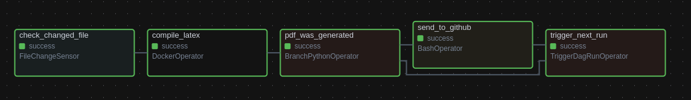

# 🚀 CV Automation with Airflow (Astro) & Docker

## 📖 Table of Contents
- [🚀 Project Overview](#-project-overview)
- [🎯 Motivation](#-motivation)
- [🛠️ Installation & Setup](#-installation--setup)
- [🚀 Usage Guide](#-usage-guide)
- [🔧 Troubleshooting](#-troubleshooting)
- [🤝 Contributing](#-contributing)
- [📩 Contact](#-contact)

## 🚀 Project Overview
The project creates a near real-time ETL that compiles **a LaTeX (`.tex`) file into a PDF** using **Apache Airflow** and **Docker**.
It continuously monitors changes in a `.tex` file (My CV at the latex/input folder) and, when changes are detected:
1. **Compiles it into a PDF** using a Docker container.
2. **Uploads the generated PDF** to a GitHub repository.
3. **Resets the workflow** to monitor future updates.
By doing this, with a simple command (astro dev start) the workflow monitors any changes to the .tex file and updates a dedicated GitHub repository with the last version of my CV.



## 🎯 Motivation
My CV was originally written in .docx, but I decided to migrate it to LaTeX for greater customization and flexibility. While platforms like Overleaf allow easy LaTeX editing, I wanted to build a fully automated, local solution using Airflow and Docker. This project creates a near real-time ETL pipeline that monitors changes to my .tex file, compiles it into a .pdf, and uploads the latest version to GitHub, ensuring I always have an up-to-date CV in a user-friendly format.

## 🛠️ Installation & Setup

### **🔹 Prerequisites**
You can try it for yourself, if you already have a .tex CV (if you don't, python libraries like pandoc can convert almost every file format to .tex). To begin, make sure you have installed:
- **Docker**: [Install Docker](https://docs.docker.com/get-docker/)
- **Docker Compose**: [Install Docker Compose](https://docs.docker.com/compose/install/)
- Generate a **GitHub Personal Access Token** [https://www.geeksforgeeks.org/how-to-generate-personal-access-token-in-github/] with "Contents" permission
- **Basic LaTeX knowledge** (if you plan to modify the `.tex` file)
- **Astro CLI** [https://www.astronomer.io/docs/astro/cli/install-cli/] to start the project

### **🔹 1️⃣ Clone This Repository**
```bash
git clone https://github.com/marcelo-martins/cv.git
cd cv/
```

### **🔹 2️⃣ Set Up Environment Variables**
Rename the .envexample file in the project root to `.env` and adapt the variables

### **🔹 3️⃣ Build and Start the Project**
```bash
astro dev start
```

### **🔹 4️⃣ Access Airflow Web UI**
After starting the project, access the **Airflow UI**:
```bash
http://localhost:8080
```
- Username: **admin**
- Password: **admin**

---

## 🚀 Usage Guide

### **🔹 Manually start the `latex_compilation` DAG** in Airflow UI to keep it running.**

### **🔹 Modifying the LaTeX File**
- Edit the `.tex` file inside `latex/input/`.
- The **Airflow DAG automatically detects the changes** and triggers the compilation.

### **🔹 Checking DAG Status**
- Open **Airflow Web UI (`http://localhost:8080`)**.
- Navigate to the **"latex_compilation" DAG**.
- Click on "Graph View" to monitor tasks.

### **🔹 Accessing the Generated PDF**
- If configured, it will also be pushed to your GitHub repository.

### **🔹 Stopping the Project**
If no modifications are detected for **10 minutes**, the DAG will **automatically stop**.
You can also stop the containers manually by running:
```bash 
astro dev stop
```
---

## 🔧 Troubleshooting

### **1️⃣ GitHub Upload Failing**
- Check if your **Personal Access Token (PAT)** has the correct permissions (`repo` scope).
- Verify the **GitHub repository URL** in `.env`.

---

## 🤝 Contributing
Feel free to submit **pull requests** or **open issues** if you have improvements or feature requests!

## 📩 Contact
For questions or suggestions, reach out via:

📧 Email: [marcelobmartins219@hotmail.com](mailto:marcelobmartins219@hotmail.com)  
🔗 LinkedIn: [https://www.linkedin.com/in/marcelobiagimartins/](https://www.linkedin.com/in/marcelobiagimartins/)  

